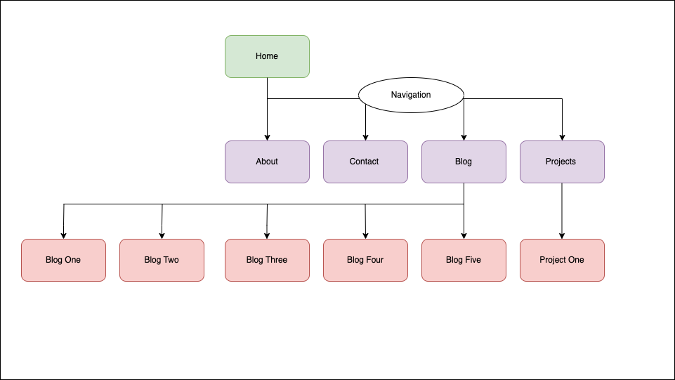

## Overview 

## Portfolio website is published here: 

https://celestemarieb.github.io/portfolio-website/

## Github repo: 

https://github.com/celestemarieb/portfolio-website

## Description 

A personal portfolio highlighting: 
- blog posts 
- information about my skills, experience and interests 
- recent work 
- how I can be contacted 

The portfolio is a publicly accessible website that can be viewed on all devices and screen-sizes. 

### Purpose

This portfolio is designed to introduce myself and my interests as well as highlight relevant skills and experience

### Features 

The website is optimised for use on mobile and desktop. 

Main pages (Home, About, Work (Projects), Writing, Contact) can be accessed via a navigation bar. 

Each individual blog and project page can access the navigation bar and return to a main page. 

responsive 

buttons / links 

### Sitemap 

The website includes the following html pages. 

Home
- About  
- Work (Projects) 
  - Project #1 
- Writing (Blog)
    - Blog #1 
    - Blog #2 
    - Blog #3
    - Blog #4 
    - Blog #5
- Contact 

I include a diagram below illustrating the relationship between each pages and the function of a navigation bar included in the site. 

### Wireframes 

### Target Audience 

This website is intended to showcase my skills, experience and interests to like-minded folk. 

### Tech Stack 

HTML
CSS 
Deployment Platform : Github Pages

### Tools 

VSCode 
Figma (design including wireframing)
Github (version control)
Github Pages (deployment and hosting)
Github Projects (project management)
Coloors (palette construction)

## Attributions 

Images used on the site are from Unsplash and the following creators: 
